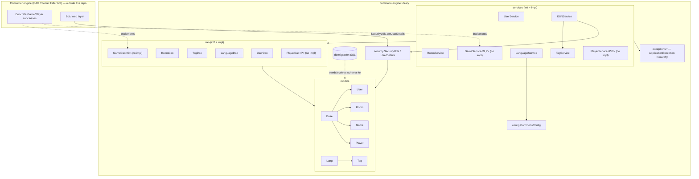
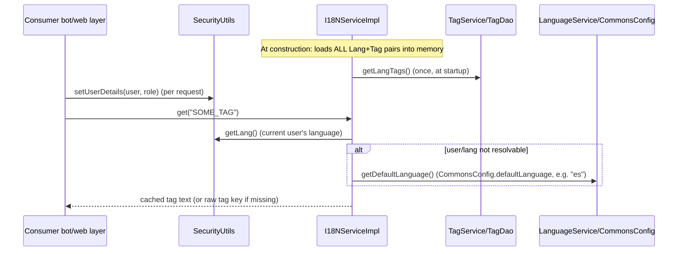
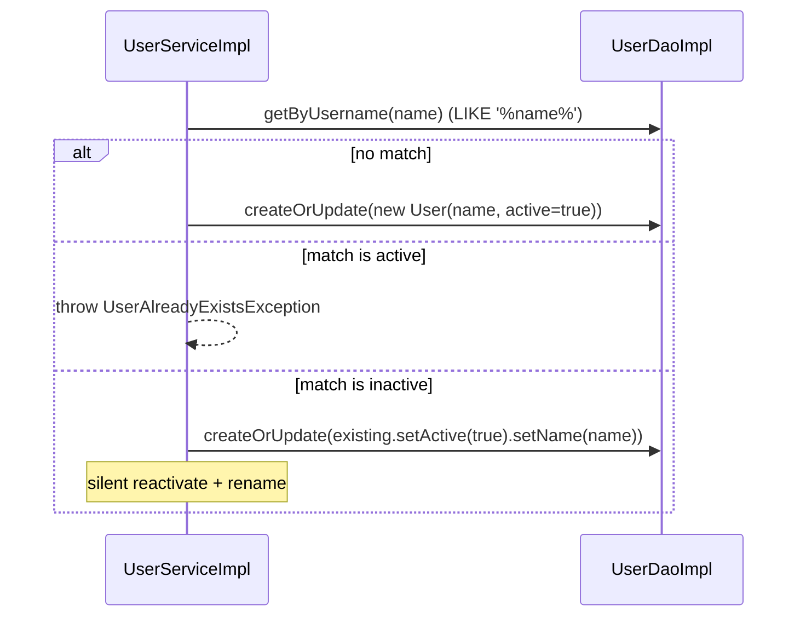

# Codebase Map

> Auto-generated by Cartographer. Last mapped: 2026-08-25T17:10:56Z

## System Overview

**Commons-Engine** (Maven artifact `commons-engine`, package `org.themarioga.commons.engine`) is a shared **"backend commons" library** — confirmed by the Spanish README: *"Este proyecto contiene los Modelos, DAOs, Servicios, etc... que conforman el 'backend' común para los engines de Cartas Contra la Humanidad y Secret Hitler"* (the models, DAOs, and services forming the common backend for two game engines — Cards Against Humanity and Secret Hitler).

**It knows nothing about Telegram, and that is deliberate** — the games are meant to be multiplatform. Some tag strings (`ERROR_COMMAND_SHOULD_BE_ON_PRIVATE`/`GROUP`) leak the assumption, but the identity model doesn't: a front-end supplies a `username`/`roomname` and the engine never learns what a chat is. The Telegram front-ends live in `Commons-Telegram` + `CAH-Telegram`.

It is **not a standalone runnable app**: no `main()`, no `@SpringBootApplication`, and `pom.xml` inherits packaging from parent `org.themarioga:parent:2.0.0`. It's built as a **library JAR**, Spring-component-scanned (`@Configuration`, `@Service`, `@Repository`), meant to be pulled in by the two concrete game engines, which supply their own `Game`/`Player` subclasses (both abstract, `TABLE_PER_CLASS`) and a Spring Boot entry point.



## Directory Structure

```
Commons-Engine/
├── pom.xml                          # Maven module, inherits from parent:2.0.0
├── README.md                        # One-line ES description of purpose
├── src/main/java/org/themarioga/engine/commons/
│   ├── config/          CommonsConfig.java             # app.* properties (default-language)
│   ├── models/          Base, User, Room, Game*, Player*, Tag, Lang   (*abstract)
│   ├── enums/           ErrorEnum, CommonErrorEnum, GameStatusEnum
│   ├── dao/             InterfaceHibernateDao, AbstractHibernateDao
│   │   ├── intf/        UserDao, RoomDao, GameDao<G>, PlayerDao<P>, TagDao, LanguageDao
│   │   └── impl/        UserDaoImpl, RoomDaoImpl, TagDaoImpl, LanguageDaoImpl (Game/Player: none)
│   ├── services/
│   │   ├── intf/        UserService, RoomService, GameService<G,P>, PlayerService<P,G>,
│   │   │                TagService, LanguageService, I18NService
│   │   └── impl/        UserServiceImpl, RoomServiceImpl, TagServiceImpl,
│   │                    LanguageServiceImpl, I18NServiceImpl (Game/Player: none)
│   ├── security/        SecurityUtils, UserDetails, UserRole
│   ├── util/             Assert, StringUtils
│   └── exceptions/
│       ├── ApplicationException, NoResultsException, UnexpectedException
│       ├── game/         9 exceptions (lifecycle/permission errors)
│       ├── player/       4 exceptions
│       ├── room/         3 exceptions
│       └── user/         3 exceptions
├── src/main/resources/
│   ├── db/migration/V1/V1.0/{V1.0.0,V1.1.0,V2.0.0}/*.sql   # Flyway migrations
│   ├── default-formatter-config.xml     # IDE code style (cosmetic)
│   └── supressed-cve-exceptions.xml     # OWASP dependency-check suppressions (empty)
├── src/test/java/org/themarioga/engine/commons/
│   ├── service/          UserServiceTest, RoomServiceTest, LanguageServiceTest, TagServiceTest
│   └── dao/              UserDaoTest, RoomDaoTest, LanguageDaoTest, TagDaoTest
└── src/test/resources/application.properties   # H2 in-memory test profile
```

## Module Guide

### Config

**Purpose**: Spring Boot `@ConfigurationProperties` bean exposing `app.*` settings.

| File | Purpose | Tokens |
|------|---------|--------|
| `config/CommonsConfig.java` | Binds `app.default-language` to `defaultLanguage`; `@Configuration @ConfigurationProperties(prefix="app") @Validated` | 94 |

**Exports**: `getDefaultLanguage()` / `setDefaultLanguage()`.
**Dependents**: `LanguageServiceImpl` (constructor-injected) to resolve the system default `Lang`.
**Gotcha**: `@Validated` is present but no bean-validation annotations exist on the field — validation is currently a no-op.

### Models (JPA entities)

**Purpose**: Core domain entities — users, rooms, games, players, tags, languages.

| File | Purpose | Tokens |
|------|---------|--------|
| `models/Base.java` | `@MappedSuperclass`: UUID `id` (`GenerationType.AUTO`), `creationDate`; equals/hashCode by id+date | 232 |
| `models/User.java` | `username` (unique **identity**), `name` (display), active flag, `Lang` (`@ManyToOne`, cascade PERSIST, lazy) | 222 |
| `models/Room.java` | `roomname` (unique **identity**), `name` (display), active flag | 179 |
| `models/Game.java` | Abstract, `TABLE_PER_CLASS`: status (`GameStatusEnum`), room (unique FK), creator (unique FK), deletionVotes (`@OneToMany` List\<User\>) | 392 |
| `models/Player.java` | Abstract, `TABLE_PER_CLASS`: game FK, user FK (unique — global one-player-slot-per-user), joinOrder | 253 |
| `models/Tag.java` | Composite PK (tag, lang); text up to 4000 chars — i18n message store | 298 |
| `models/Lang.java` | PK = 2-char code (e.g. "es"/"en"), unique name | 252 |

**Patterns**: `@MappedSuperclass` for id/audit fields; `TABLE_PER_CLASS` inheritance for `Game`/`Player` (each concrete subclass gets its own table with all inherited columns); lazy `@ManyToOne`; explicit `@Index` on name columns.
**Dependencies**: `enums.GameStatusEnum`.
**Dependents**: DAO layer, service layer, security (`UserDetails` wraps `User`), tests.

**The identity split** is the thing to understand here. `username`/`roomname` are the **stable, unique** identity a front-end can look a row up by; `name` is what gets shown and can change at any time (people rename themselves and their groups). They were one field, which meant renaming yourself either collided with someone else or silently created a second account. Front-ends supply the identity: the Telegram one uses the `@alias` (or `tg:<id>`), and `tg:<chatId>` for rooms.

**Gotchas**: `Base.equals`/`hashCode` must stay null-safe — they compare `id` + `creationDate`, both null on a transient entity, so the naive version NPE'd on anything not yet persisted.

### Enums

| File | Purpose | Tokens |
|------|---------|--------|
| `enums/ErrorEnum.java` | Interface: `getErrorCode()`/`getErrorDesc()` — lets any enum act as a typed error code | 27 |
| `enums/CommonErrorEnum.java` | Implements `ErrorEnum`; ~28 numbered error codes (0–27), Spanish descriptions; `getByCode`/`getByDesc` lookups | 671 |
| `enums/GameStatusEnum.java` | Lifecycle states: `CREATED`, `STARTED`, `ENDING`, `DELETING` | 33 |

**Gotcha (bug)**: `GameCreatorAlreadyExistsException` is wired to `GAME_ALREADY_EXISTS` instead of the distinct `GAME_CREATOR_ALREADY_EXISTS` (code 21). `GameNotEndingException` and `GameNotStartedException` are **both** wired to `GAME_NOT_CONFIGURED` (code 14), leaving `GAME_NOT_ENDING` (code 15) unused and making the two exceptions indistinguishable by error code/message.

### DAO Layer

**Purpose**: Data access via Hibernate/JPA `EntityManager`/`Session`; generic CRUD base + entity-specific queries.

| File | Purpose | Tokens |
|------|---------|--------|
| `dao/InterfaceHibernateDao.java` | Generic CRUD contract: create, createOrUpdate, delete, deleteById, findOne, findAll, countAll, raw EntityManager/Session accessors | 98 |
| `dao/AbstractHibernateDao.java` | Generic base impl; JPQL `"from " + clazz.getName()`; `EntityManager.persist/merge/remove/find`; unwraps Hibernate `Session` | 362 |
| `dao/intf/UserDao.java`, `RoomDao.java` | Extend `InterfaceHibernateDao<User/Room>` + `getByUsername`/`getByRoomname` | 54, 58 |
| `dao/intf/GameDao.java`, `PlayerDao.java` | **Standalone generic interfaces** (don't extend `InterfaceHibernateDao`), parameterized `<G extends Game>`/`<P extends Player>` — no impl provided (consumer responsibility) | 85, 78 |
| `dao/intf/TagDao.java`, `LanguageDao.java` | Plain read-only lookup interfaces | 57, 57 |
| `dao/impl/UserDaoImpl.java`, `RoomDaoImpl.java` | `@Repository`, extend `AbstractHibernateDao`; HQL `LIKE '%name%'` search | 137, 146 |
| `dao/impl/TagDaoImpl.java`, `LanguageDaoImpl.java` | `@Repository`, hold `EntityManager` directly; HQL via unwrapped `Session` | 184, 261 |

**Patterns**: interface + impl split, `@Repository`, inconsistent DI style (field-setter `@Autowired setEntityManager` on the abstract base vs constructor injection for Tag/Language DAOs). Uses Hibernate 6 `getSingleResultOrNull()`.
**Dependencies**: `jakarta.persistence`, `org.hibernate.Session`, models.
**Dependents**: service layer.
**Gotcha — `create` vs `createOrUpdate`**: `createOrUpdate` is `merge`, which cannot insert an entity whose identifier is *derived* from an association (`@Id @OneToOne`) — it fails with "Identifier may not be null". That's what `create` (`persist`) is for. Downstream, `TelegramGame`/`TelegramPlayer` are exactly that shape.

`getByUsername`/`getByRoomname` are **exact** matches on the unique identity columns (they used to be `LIKE '%x%'` substring searches against `name`, which could match unintended rows).

### Service Layer

**Purpose**: Business logic, transaction boundaries, validation atop the DAO layer.

| File | Purpose | Tokens |
|------|---------|--------|
| `services/intf,impl/UserService(Impl)` | create-or-reactivate, rename, activate/deactivate, set language, lookups, list all | 109 / 905 |
| `services/intf,impl/RoomService(Impl)` | Same shape as UserService, for rooms | 88 / 869 |
| `services/intf/GameService<G,P>` | **Interface only** — create, update, delete, setMaxNumberOfPlayers, setStatus, addPlayer/removePlayer, startGame, endGame, voteForDeletion, getByRoom. No impl in this module | 184 |
| `services/intf/PlayerService<P,G>` | **Interface only** — create, delete, findById/byUser/byUserId/byGameAndUser. No impl | 113 |
| `services/intf,impl/TagService(Impl)` | `getTagsByLang(lang)`, falls back to system default language if not found | 45 / 211 |
| `services/intf,impl/LanguageService(Impl)` | getLanguage(id), getDefaultLanguage() (reads `CommonsConfig`), getLangs() | 55 / 323 |
| `services/intf,impl/I18NService(Impl)` | Preloads **all** tag/lang pairs into memory at construction; `get(tag)`/`get(tag,lang)`/`get(tag,langId)`; falls back to current user's lang (via `SecurityUtils`) or default | 75 / 626 |

**Patterns**: interface+impl split, `@Service`, constructor injection, SLF4J logging before throwing, `@Transactional(propagation=REQUIRED, rollbackFor=ApplicationException.class)` on writes / `SUPPORTS` on reads, `util.Assert` for validation, "create-or-reactivate" idiom (reuse a soft-deleted row by name instead of duplicating).
**Gotchas**:
- `I18NServiceImpl` caches all tags **once at startup** — DB edits afterward require an app restart (no invalidation).
- Tag text uses a literal `\n` → real newline replacement baked into `I18NServiceImpl.getLangTags` — multi-line tags depend on this exact escaping convention in the seed SQL.
- `createOrReactivate(username, name, lang)`: matches on the **identity** column; an existing **active** row throws `*AlreadyExistsException`, an **inactive** one is silently reactivated and given the new display name — a non-obvious soft-delete/reuse behavior.
- Validation coverage is inconsistent: `rename`/`setActive`/`setLanguage` skip `Assert` checks that `createOrReactivate` performs.
- `UserServiceImpl.getByUsername` does **not** check the `active` flag (unlike `getById`), so inactive users can be fetched by username without error.

### Security

**Purpose**: Spring-Security-based "current user" context helpers for a bot-style app (context set programmatically, not via login form).

| File | Purpose | Tokens |
|------|---------|--------|
| `security/SecurityUtils.java` | Static helpers: `isLoggedIn`, `getUser`, `getId`, `getName`, `getLang`, `isAdmin` (`ROLE_ADMIN`), `setUserDetails` (populates `SecurityContextHolder`) | 441 |
| `security/UserDetails.java` | Wraps `User` + `UserRole`; grants `ROLE_ADMIN`+`ROLE_USER` for admins, `ROLE_USER` otherwise; `getPassword()` returns `null` | 280 |
| `security/UserRole.java` | `ADMIN`/`USER` enum with string value | 57 |

**Dependencies**: Spring Security core, `models.User`, `exceptions.user.UserDoesntExistsException`.
**Dependents**: `I18NServiceImpl` (resolve current user's language); presumably the consumer's bot/web layer calls `setUserDetails` per request.
**Gotcha**: `setUserDetails(User, UserRole)` throws `UserDoesntExistsException` on a null arg — a domain/business exception used as what's really a null-check guard clause.

### Utils

| File | Purpose | Tokens |
|------|---------|--------|
| `util/Assert.java` | Validation helper: `assertNotNull`/`assertNull`/`assertNotEmpty`/`assertEmpty`, throws `ApplicationException(ErrorEnum)` | 167 |
| `util/StringUtils.java` | `isNumeric`, `formatMessage` (wraps `MessageFormat.format` for `{0}`-style tag placeholders), `booleanToSpanish` ("Si"/"No") | 138 |

**Dependents**: services (`Assert` in `UserServiceImpl`/`RoomServiceImpl`); `StringUtils.formatMessage` is presumably used downstream by consumers to interpolate `I18NService.get()` output.

### Exceptions

**Purpose**: Flat, error-code-driven exception hierarchy rooted at one base `RuntimeException`.

- `ApplicationException extends RuntimeException` — holds an `ErrorEnum`; `getMessage()` returns `error.getErrorDesc()` when an enum is set. Root of nearly every domain error here.
- `NoResultsException`, `UnexpectedException` extend plain `Exception` (checked) — **not** part of the `ApplicationException` hierarchy and appear unused within this module — likely reserved for consumer use.
- 9 `exceptions/game/*`, 4 `exceptions/player/*`, 3 `exceptions/room/*`, 3 `exceptions/user/*` — each a trivial no-arg subclass hardcoding one `CommonErrorEnum` constant.

**Pattern**: exception-per-business-rule, letting callers catch a specific type or the common `ApplicationException` and read the error enum/message to show a localized tag.
**Gotchas (bugs)**: see [Enums](#enums) above — `GameCreatorAlreadyExistsException` and the `GameNotEndingException`/`GameNotStartedException` pair are mis-wired to the wrong/duplicate error codes.

### DB Migrations (Flyway)

**Purpose**: Versioned schema evolution under `db/migration/V1/V1.0/{V1.0.0,V1.1.0,V2.0.0}/`.

| File | Purpose | Tokens |
|------|---------|--------|
| `V1.0.0_1__Initial_migration.sql` | Creates `t_configuration`, `t_user`, `t_room`, `t_game` (FK room+creator, unique room), `t_player` (FK user+game, unique user) | 443 |
| `V1.0.0_2__Traceability.sql` | Adds `creation_date` TEXT column to all 4 base tables | 57 |
| `V1.1.0_1__UserNameIndex.sql` | Adds index on `t_user.name` | 28 |
| `V2.0.0_1__Languages.sql` | Creates `t_lang`, seeds `es`/`en`, adds `t_user.lang_id` FK (default `'es'`) | 113 |
| `V2.0.0_2__Tags.sql` | Creates `t_tag` (composite PK tag+lang), seeds ~40 Spanish UI strings | 1192 |
| `V2.0.0_3__LanguageConfiguration.sql` | Seeds `t_configuration('default_language','es')` | 25 |
| `V2.0.0_4__EnglishTags.sql` | Seeds English translations of the same tag keys | 1011 |

**Gotchas**:
- `create Game t_lang` / `create Game t_tag` — typo (`Game` instead of `table`) in `V2.0.0_1`/`V2.0.0_2`; broken as standard SQL, suggesting these scripts aren't exercised by tests (tests use Hibernate `ddl-auto=create-drop`, bypassing Flyway entirely).
- `V2.0.0_4`'s internal comment says `v2.0.0_5`, but the filename says `_4` — versioning comment mismatch.
- One English tag is left untranslated: `ERROR_PLAYER_ALREADY_JOINED` for locale `en` still has Spanish text.
- **Schema/entity mismatch**: raw SQL uses `BIGINT`/`AUTO_INCREMENT` ids, but the JPA `Base` model uses `UUID` ids — this SQL schema looks legacy/vestigial relative to the current entity model.

### Tests

**Purpose**: Unit tests for the service and DAO layers (no tests for security, exceptions, or the unimplemented generic `Game`/`Player` interfaces).

| File | Coverage |
|------|----------|
| `service/UserServiceTest.java` | create/reactivate (new, reactivate-inactive, already-active conflict), rename, setActive, setLanguage, getById (found/missing/inactive), getByUsername (found/missing), getAllUsers |
| `service/RoomServiceTest.java` | Same shape as UserServiceTest, for Room |
| `service/LanguageServiceTest.java` | getLanguage, getDefaultLanguage (mocks `CommonsConfig`), getLangs |
| `service/TagServiceTest.java` | Single happy-path test for `getTagsByLang` |
| `dao/UserDaoTest.java`, `RoomDaoTest.java` | CRUD (create/update via `merge`, delete, findOne, findAll, countAll) + custom query, via mocked `EntityManager`/`Session`/`TypedQuery`/`Query` |
| `dao/LanguageDaoTest.java` | getLanguage, checkLanguageExists, getLanguages via mocked Hibernate `Query` |
| `dao/TagDaoTest.java` | getTagsByLang via mocked Hibernate `Query` |

**Frameworks**: JUnit 5, Mockito 5 (`@ExtendWith(MockitoExtension.class)`, `@Mock`/`@InjectMocks`) — pure unit tests, no Spring context loaded. `src/test/resources/application.properties` configures an H2 in-memory DB + dbunit schema, but the DAO tests actually mock `EntityManager`/`Session` rather than hitting a real database — that config may be vestigial for the files read here.

## Data Flow

### i18n / localization lookup



### create-or-reactivate (User / Room)



## Conventions

- **Interface + impl split** everywhere: `dao/intf` + `dao/impl`, `services/intf` + `services/impl`.
- **Exception-per-business-rule**: each domain error is its own no-arg `ApplicationException` subclass pre-wired to one `CommonErrorEnum` constant, grouped by aggregate (`exceptions/game`, `player`, `room`, `user`).
- **`@MappedSuperclass` + `TABLE_PER_CLASS`**: `Base` supplies id/creationDate to all entities; `Game`/`Player` are abstract and left for consumers to subclass concretely.
- **Spanish-first**: error descriptions, seed tag text, and `StringUtils.booleanToSpanish` are all Spanish by default, with English as a secondary locale.
- **Transactions**: writes use `@Transactional(propagation=REQUIRED, rollbackFor=ApplicationException.class)`; reads use `@Transactional(propagation=SUPPORTS)`.
- **Testing**: pure Mockito unit tests (`@ExtendWith(MockitoExtension.class)`), no Spring context bootstrapped for tests in this module.

## Gotchas

- **`Game`/`Player`/`GameDao`/`PlayerDao`/`GameService`/`PlayerService` are unimplemented here** — this library only supplies shared scaffolding; concrete game rules live in the downstream CAH / Secret Hitler engine repos. Don't expect to find their impls in this repo.
- **Mis-wired error codes** (real bugs, worth flagging): `GameCreatorAlreadyExistsException` → `GAME_ALREADY_EXISTS` instead of `GAME_CREATOR_ALREADY_EXISTS`; `GameNotEndingException` and `GameNotStartedException` both → `GAME_NOT_CONFIGURED`, leaving `GAME_NOT_ENDING` dead.
- **`Room.toString()`** uses `getName()` twice instead of `getId()`.
- **DAO name lookups do substring matching** (`LIKE '%x%'`) via `getByUsername`/`getRoomName`, which can throw on multiple matches via `getSingleResultOrNull()`.
- **`I18NServiceImpl` caches tags once at startup** — no refresh mechanism; DB edits need an app restart to take effect.
- **`UserServiceImpl.getByUsername` skips the active-flag check** that `getById` performs — inconsistent enforcement.
- **Flyway SQL typo**: `create Game t_lang`/`t_tag` instead of `create table` in `V2.0.0_1`/`V2.0.0_2` — likely never actually exercised (tests bypass Flyway via Hibernate `ddl-auto=create-drop`).
- **Schema/entity mismatch**: raw SQL migrations use `BIGINT`/`AUTO_INCREMENT` ids while JPA entities use `UUID` — the SQL schema looks legacy/vestigial.
- **One untranslated tag**: `ERROR_PLAYER_ALREADY_JOINED` under locale `en` still holds Spanish text.
- **OWASP suppression file is empty** — no CVEs currently suppressed, so `dependency-check` runs unmodified.

## Navigation Guide

**To add a new domain error**: add a constant to `enums/CommonErrorEnum.java`, then create a small subclass under the matching `exceptions/{game,player,room,user}/` package that hardcodes it — check for an already-unused constant before reusing one (see the Gotchas above).

**To add a new i18n string**: add a Flyway migration seeding `t_tag` rows for each supported `lang_id` (see `V2.0.0_2__Tags.sql` / `V2.0.0_4__EnglishTags.sql` as templates); remember `I18NServiceImpl` only picks up new rows on next startup.

**To add a CRUD entity + service** (following the User/Room pattern): model in `models/`, a DAO interface in `dao/intf/` extending `InterfaceHibernateDao<T>`, an impl in `dao/impl/` extending `AbstractHibernateDao<T>`, a service interface in `services/intf/`, and an impl in `services/impl/` using `Assert` for validation and the "create-or-reactivate" idiom if it needs soft-delete semantics.

**To implement `Game`/`Player` for a specific engine**: in the consumer repo, subclass `Game`/`Player`, implement `GameDao<G>`/`PlayerDao<P>` and `GameService<G,P>`/`PlayerService<P,G>` against this module's models/exceptions/`GameStatusEnum`.

**To change default language / add a supported language**: update `t_lang` via a new Flyway migration and adjust `app.default-language` (bound by `CommonsConfig`) in the consumer's `application.properties`.

**To wire authentication for a new request path**: call `SecurityUtils.setUserDetails(user, role)` early in the request lifecycle so `I18NService`/admin checks resolve correctly downstream.
